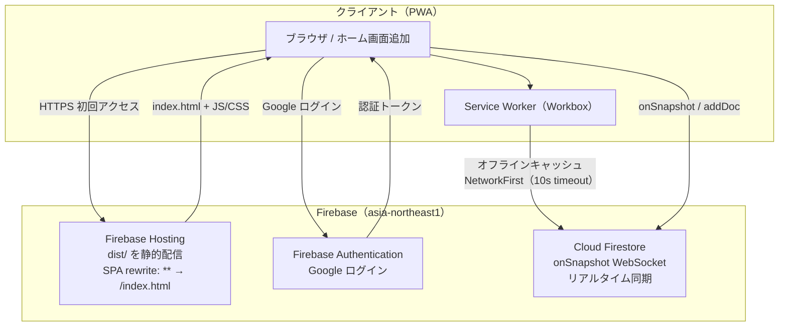
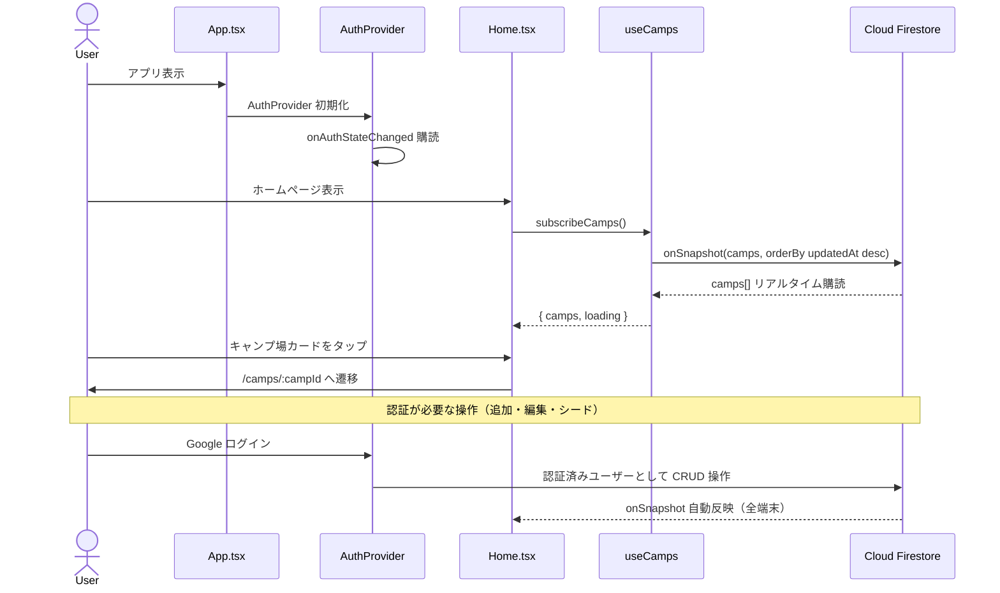

# アーキテクチャ詳細

## 1. システム構成図



## 2. データフロー図



## 3. Firestore データモデル

### `camps/{campId}`

`src/types/camp.ts` の `Camp` interface に対応:

| フィールド | 型 | 説明 |
|------------|----|------|
| `name` | `string` | キャンプ場名（必須） |
| `location` | `string` | 場所・都道府県（必須） |
| `address` | `string \| null` | 住所 |
| `phone` | `string \| null` | 電話番号 |
| `businessHours` | `string \| null` | 営業時間 |
| `url` | `string \| null` | 公式URL |
| `memo` | `string \| null` | メモ（任意） |
| `imageUrls` | `string[]` | 画像URL一覧 |
| `type` | `'glamping' \| 'campsite'` | 施設タイプ |
| `region` | `Region \| null` | 地域（北海道〜九州・沖縄） |
| `description` | `string \| null` | 説明文 |
| `features` | `string[]` | 特徴タグ（Wi-Fi, AC電源 等） |
| `seasons` | `Season[]` | おすすめシーズン |
| `pricePerNight` | `number \| null` | 1泊料金 |
| `rating` | `number \| null` | 評価 |
| `nearbyAttractions` | `string[]` | 周辺スポット |
| `capacity` | `number \| null` | 定員 |
| `camperVanAllowed` | `boolean` | キャンピングカーOK |
| `hasDogRun` | `boolean` | ドッグランあり |
| `dogRunPrice` | `DogRunPrice \| null` | ドッグラン料金（小型/中型/大型/一般） |
| `createdAt` | `Timestamp` | 作成日時 |
| `updatedAt` | `Timestamp` | 更新日時 |

## 4. クライアント技術スタック

| カテゴリ | ライブラリ / ツール | バージョン | 用途 |
|----------|---------------------|------------|------|
| フレームワーク | React | ^19 | UIレンダリング |
| 言語 | TypeScript (strict) | ~5.7 | 型安全な開発 |
| ビルド | Vite | ^6 | 高速ビルド・HMR |
| スタイリング | Tailwind CSS v4 | ^4 | ユーティリティCSS |
| ルーティング | React Router | ^7 | SPA ルーティング |
| バックエンド | Firebase SDK | ^11 | Firestore + Auth |
| 認証 | Firebase Authentication | ^11 | Google ログイン |
| アニメーション | motion | ^12 | UIアニメーション（import from `motion/react`） |
| アイコン | lucide-react | ^0.575 | SVG アイコンコンポーネント |
| トースト | sonner | ^2 | 通知トースト |
| 状態管理 | React Context + onSnapshot | — | Auth + サーバー状態 |
| ユーティリティ | clsx | ^2 | 条件付きクラス結合 |
| PWA | vite-plugin-pwa / Workbox | ^0.21 | Service Worker・オフライン |
| テスト | Vitest + RTL | ^2 / ^16 | ユニット・統合テスト |
| Linting | ESLint + Prettier | ^9 / ^3 | 静的解析・フォーマット |

## 5. インフラ技術スタック

| サービス | 用途 | リージョン |
|----------|------|------------|
| Firebase Hosting | 静的ホスティング・SPA配信 | グローバル CDN |
| Firebase Authentication | Google ログイン認証 | グローバル |
| Cloud Firestore | NoSQL リアルタイムデータベース | asia-northeast1（東京） |

## 6. フォルダ構成

```
campus/
├── public/                  # 静的アセット（アイコン・favicon）
├── src/
│   ├── main.tsx             # エントリーポイント
│   ├── App.tsx              # ルーティング定義（React Router）+ AuthProvider
│   ├── index.css            # Tailwind CSS インポート
│   │
│   ├── components/          # 再利用可能な UI コンポーネント
│   │   ├── AuthButton.tsx   # Google ログイン/ログアウトボタン
│   │   ├── BookingModal.tsx # 予約モーダル
│   │   ├── CampCard.tsx     # キャンプ場カード（一覧表示用）
│   │   ├── Footer.tsx       # フッター
│   │   ├── HeroSection.tsx  # ヒーロースライドショー（motion AnimatePresence）
│   │   ├── ImageCarousel.tsx # 画像カルーセル
│   │   ├── MapEmbed.tsx     # Google マップ埋め込み
│   │   └── ProtectedRoute.tsx # 認証ガード（未ログイン時リダイレクト）
│   │
│   ├── contexts/            # React Context
│   │   ├── AuthContext.tsx   # AuthProvider コンポーネント
│   │   └── authContextDef.ts # AuthContext 型定義・createContext
│   │
│   ├── hooks/               # カスタムフック（Firestore リアルタイム購読）
│   │   ├── useAuth.ts       # 認証フック（useContext ラッパー）
│   │   ├── useCamp.ts       # 単一キャンプ場の購読
│   │   └── useCamps.ts      # キャンプ場一覧の購読
│   │
│   ├── lib/
│   │   ├── firebase/
│   │   │   ├── app.ts       # Firebase アプリ初期化
│   │   │   ├── auth.ts      # Firebase Auth インスタンス + Google Provider
│   │   │   └── firestore.ts # Firestore db インスタンスのエクスポート
│   │   ├── camps.ts         # キャンプ場の CRUD 関数
│   │   └── time.ts          # Timestamp ↔ datetime-local 変換ユーティリティ
│   │
│   ├── pages/               # ルートに対応するページコンポーネント
│   │   ├── Home.tsx         # / : キャンプ場一覧 + ヒーロー + シーズン選択
│   │   ├── CampDetail.tsx   # /camps/:campId : 詳細・地図
│   │   ├── CampForm.tsx     # /camps/new, /camps/:campId/edit : 追加・編集フォーム
│   │   └── SeedPage.tsx     # /admin/seed : 初期データ投入（管理用）
│   │
│   └── types/               # グローバル型定義
│       └── camp.ts          # Camp, CampPayload, CampType, Season, Region, DogRunPrice
│
├── docs/                    # ドキュメント
│   ├── architecture.md      # このファイル
│   └── coding-guideline.md  # コーディング規約
├── .claude/rules/           # Claude Code AI ルール定義
├── firestore.indexes.json   # Firestore インデックス定義
├── firestore.rules          # Firestore セキュリティルール
├── firebase.json            # Firebase プロジェクト設定
├── vite.config.ts           # Vite + PWA 設定
├── tsconfig.json            # TypeScript 設定
└── package.json
```

## 7. ルーティング

| パス | コンポーネント | 認証 | 説明 |
|------|---------------|------|------|
| `/` | `Home` | 不要 | キャンプ場一覧 + ヒーロー + シーズン選択 |
| `/camps/new` | `CampForm` | **必要**（ProtectedRoute） | キャンプ場新規追加フォーム |
| `/camps/:campId` | `CampDetail` | 不要 | キャンプ場詳細・地図 |
| `/camps/:campId/edit` | `CampForm` | **必要**（ProtectedRoute） | キャンプ場情報編集フォーム |
| `/admin/seed` | `SeedPage` | **必要**（ProtectedRoute） | 初期データ投入（管理用） |

全ルートは `React.lazy` + `Suspense` で遅延ロードされます。
Firebase Hosting の `rewrite: "** → /index.html"` により、SPA のディープリンクが機能します。

## 8. 状態管理方針

| 状態の種類 | 手法 | 具体例 |
|-----------|------|--------|
| ローカル UI 状態 | `useState` | フォームの入力値・ローディングフラグ |
| 認証状態 | React Context（`AuthContext`） | ログインユーザー・認証ローディング |
| サーバー状態 | Firestore `onSnapshot` リアルタイム購読 | キャンプ場一覧（`useCamps`）・単一キャンプ場（`useCamp`） |

- **カスタムフック分離**: すべての Firestore 購読ロジックは `hooks/` に切り出し、クリーンアップ（`unsubscribe`）を確実に実施
- **認証パターン**: `AuthProvider` → `useAuth()` フック → `ProtectedRoute` コンポーネントで認証ガード
